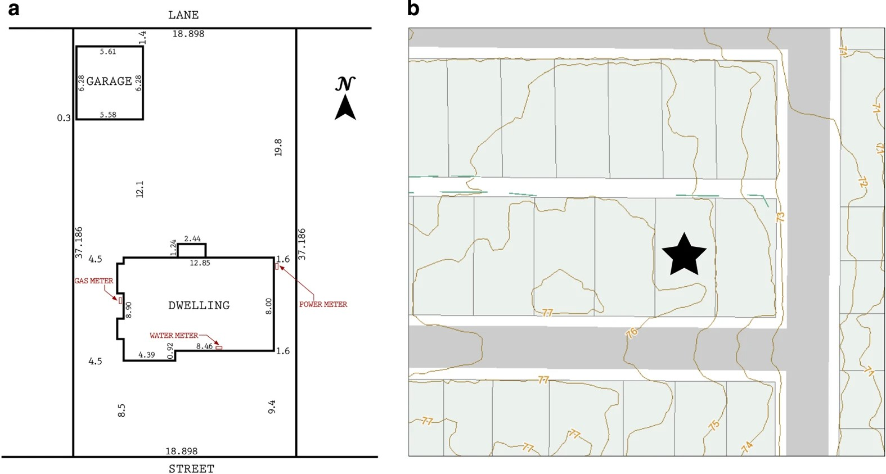

# AMPds2: The Almanac of Minutely Power dataset (Version 2)

**Description**

This dataset is intended to be multi-year capture of the consumption of my
house. This dataset contains electricity, water, and natural gas measurements at
one minute intervals. This dataset contains a total of 1,051,200 readings for 2
years of monitoring (from April/2012 to March/2014) per meter. There are a total
of 21 power meters, 2 water meters (with additional appliance usage
annotations), and 2 natural gas meters. Weather data from Environment Canada's
YVR weather station has also been added. This hourly weather data covers the
same period of time as AMPds and includes a summary of climate normals observed
from the years between 1981-2010. Billing data from utility companies is also
included for cost/benefit analysis. (2015-05-07)

**Sensor layout**

> Figure 1: Test House Property. Surrounding area of house: (a) property survey
and (b) location in surrounding block. Yellow lines show 1 m elevation contours.

From: Electricity, water, and natural gas consumption of a residential house in
Canada from 2012 to 2014

**Data files & Format**

Files are split into smaller files (100,000 rows/each)

| File            | Description                         | Variables | Observations | 
|:----------------|:------------------------------------|:---------:|:------------:|
| Electricity_B1E | North Bedroom Electricity Sub-Meter |    12     |   1051200    |
| NaturalGas_FRG  | Furnace Gas Sub-Meter Readings      |     4     |   1051200    |
| Water_WHW       | Whole-House Water Meter Readings    |     4     |   1051200    |

**Dataset source**

<https://dataverse.harvard.edu/dataset.xhtml?persistentId=doi:10.7910/DVN/FIE0S4/>

**Terms of Use**

Creative Commons Attribution licence (CC-BY) see
<https://creativecommons.org/licenses/by/4.0/>

You must cite: Makonin, S. et al. Electricity, water, and natural gas
consumption of a residential house in Canada from 2012 to 2014. Sci. Data
3:160037 doi: 10.1038/sdata.2016.37 (2016).

