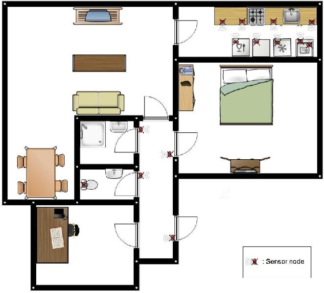

# Activity Recognition Dataset from University of Amsterdam

Activity recognition dataset consisting of 28 days of sensor data.

### Sensor layout

> Figure 3. Floorplan of the house, red rectangle boxes indicate sensor nodes.

Sensor ID list:

- 1 - Microwave
- 5 - Hall-Toilet door
- 6 - Hall-Bathroom door
- 7 - Cups cupboard
- 8 - Fridge
- 9 - Plates cupboard
- 12 - Frontdoor
- 13 - Dishwasher
- 14 - ToiletFlush
- 17 - Freezer
- 18 - Pans Cupboard
- 20 - Washingmachine
- 23 - Groceries Cupboard
- 24 - Hall-Bedroom door
 
Activity ID list:

- 1 - leave house
- 4 - use toilet
- 5 - take shower
- 10 - go to bed
- 13 - prepare Breakfast
- 15 - prepare Dinner
- 17 - get drink

### Data files & format

| File            | Description                                         |
|-----------------|-----------------------------------------------------|
| sensors         | sensor data in format: `START_TIME,END_TIME,ID,VAL` |
| activities      | activities in format: `START_TIME,END_TIME,ID`      |

- time format: `DD-MMM-YYYY HH:MM:SS`
- val: value of sensor (always 1)

### Dataset source

<http://casas.wsu.edu/datasets/kasterenDataset.zip>

Acknowledgement: In creating the sensorGUI visualization tool some segments of
support code from Emmanuel Munguia Tapia's dataset were used. His dataset and
the original code can be found at: <http://courses.media.mit.edu/2004fall/mas622j/04.projects/home/>

### Papers

This dataset and experiments performed on it, is carefully described in:
Accurate Activity Recognition in a Home Setting T.L.M. van Kasteren, A. K.
Noulas, G. Englebienne and B.J.A. Kr�se Tenth International Conference on
Ubiquitous Computing 2008 (Ubicomp'08). Please refer to this paper when you
include experiments on this dataset in your publications.

