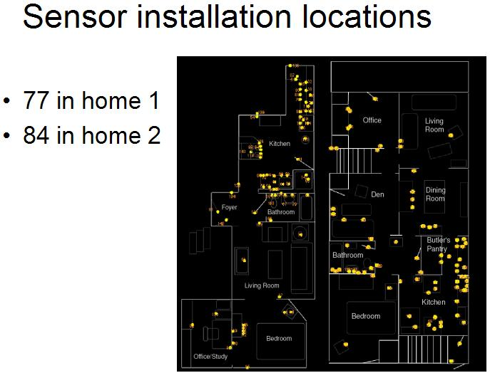

# Activity Recognition in the Home Setting Using Simple and Ubiquitous Sensors

**Description**

Between 80-100 reed switch sensors where installed in two single-person
apartments collecting data about human activity for two weeks. The sensors
were installed in everyday objects such as drawers, refrigerators, containers,
etc to record opening-closing events (activation deactivation events) as
the subject carried out everyday activities.

**Sensor layouts**

**Data files & Format**

Each directory contains the data of a different subject and each subdirectory
contains the following files:

| File            | Description                                                       |
|-----------------|-------------------------------------------------------------------|
| sensors         | sensor information: `SENSOR_ID,LOCATION,OBJECT`                   |
| activities      | all analyzed activities: `HEADING,CATEGORY,SUBCATEGORY,CODE`      |
| activities_data | data of the activities: `ACTIVITY_LABEL,DATE,START_TIME,END_TIME` |
 
- where date is in the `mm/dd/yyyy` format
- where time is in the `hh:mm:ss` format
- NOTE: `ACTIVITY_LABEL` = Subcategory

**Dataset source**

<https://courses.media.mit.edu/2004fall/mas622j/04.projects/home/>

**Papers**

This directory contains the data collected for the thesis:

"Activity Recognition in the Home Setting Using Simple and Ubiquitous sensors"
by Emmanuel Munguia Tapia

for any referece to this work or dataset please use:

- E. Munguia Tapia. Activity Recognition in the Home Using Simple and Ubiquitous
Sensors. Pervasive 2004,Vienna, Austria.

- E. Munguia Tapia. Activity Recognition in the Home Setting Using Simple and
Ubiquitous Sensors. S.M. Thesis, Massachusetts Institute of Technology, 2003.

Send any questions or comments to Emmanuel Munguia Tapia <emunguia@media.mit.edu/>

