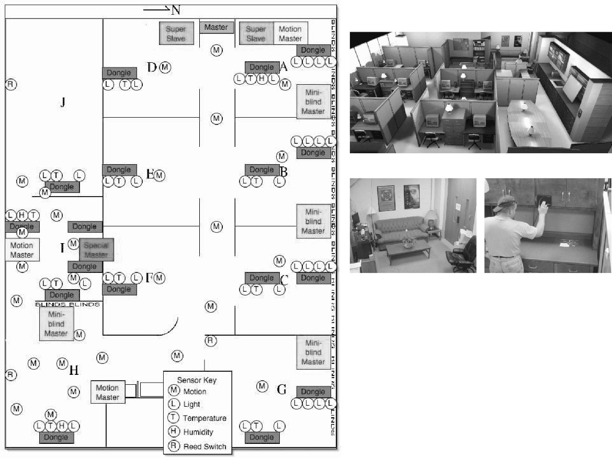
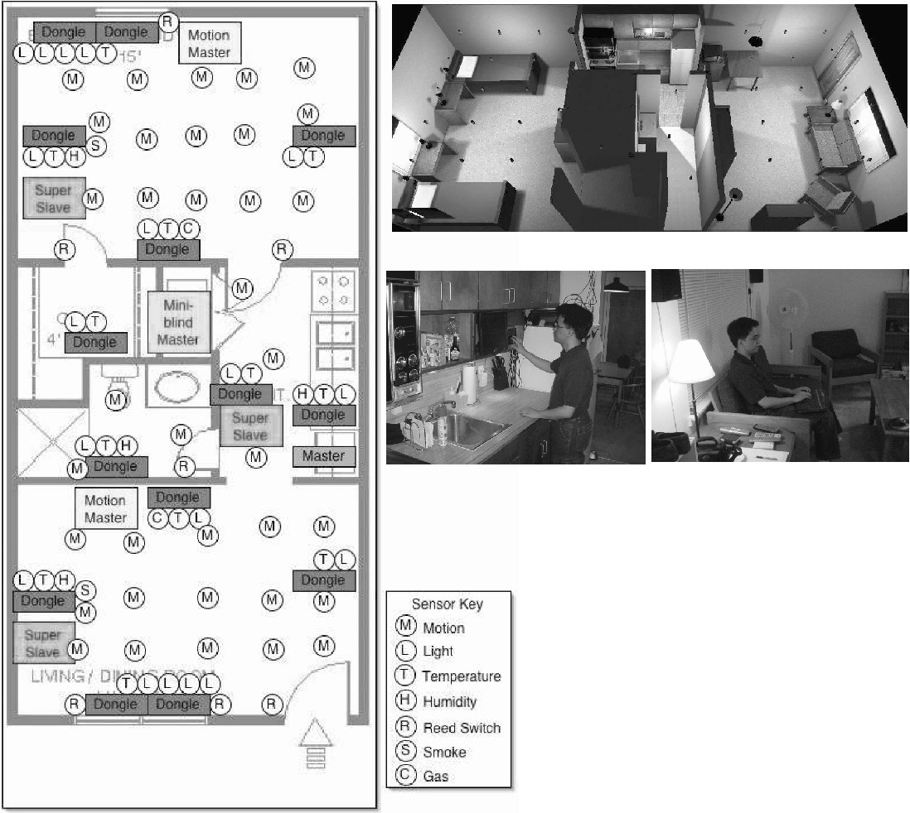

# MavLab dataset

**Description**

These datasets represent sensor events collected in the MavLab testbed
during March and April of 2003.  During this time approximately six students
worked in the lab on a regular basis.

**Sensor layouts**

Layout of the sensors in the testbed and a few image captures of the environment:

> Fig. 5 (below). MavLab workplace environment. The lab is equipped with temperature, light, and motion sensors, and can control all lights, appliances, fans, heaters, and window blinds.

> Fig. 6 (below). MavPad apartment. The apartment is equipped with motion, light, temperature, humidity, door, water leak, smoke, and CO2 sensors, and can control lights, fans, TV, receiver, window blinds, HVAC, and diffusers.

**Data files & Format**

- There is one sensor event on each line of the files. 
- Category labels: `Date, Time AM/PM, Location, SensorID, Value`
- Data converted to CSV format

**Dataset source**

<http://casas.wsu.edu/datasets/mavlab.zip/>

**Papers**

G. M. Youngblood and D. Cook, Data mining for hierarchical
model creation, IEEE Transactions on Systems, Man, and
Cybernetics, Part C, 37(4):561-572, 2007.
